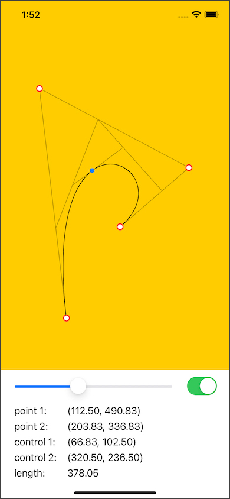

# BezierVisualizer

**BezierVisualizer** is a simple bezier curve visualization tool. You can drag the control point handles to change the curve shape. You can also drag a slider to visualize the curve construction.

## Getting Started
To run the app you need to add a `User.xconfig` file in the `BezierVisualizer` folder. Include your settings for `PRODUCT_BUNDLE_IDENTIFIER_PREFIX` and `DEVELOPMENT_TEAM`.
